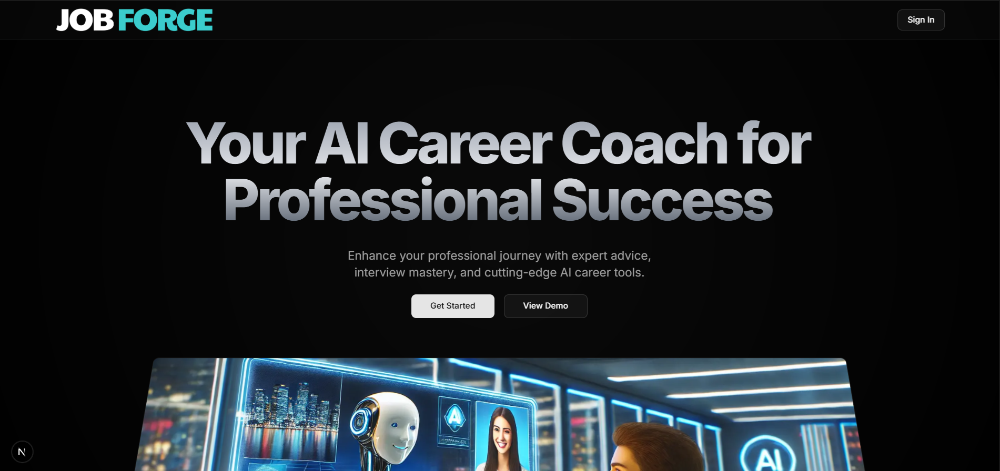

# JobForge 🔥  
*AI Powered Career Platform*

An all-in-one platform to supercharge your career journey — helping users analyze in-demand skills, prepare for interviews, and generate professional documents effortlessly using AI.

---

## Features 🚀  

- 🔐 Authentication with Clerk  
- 📊 Visual Skill Analytics Dashboard  
- 🤖 AI-Powered Interview Prep with Scoring & Feedback  
- 📄 Resume Builder with Markdown Editor & PDF Download  
- 📝 AI-Generated Cover Letter Creator  

---

## Tech Stack 🛠️  

| Technology        | Purpose                                  |
|------------------|------------------------------------------|
| Next.js          | Frontend & Backend Framework             |
| Tailwind CSS     | Styling & Responsive Design              |
| Prisma           | Database ORM                             |
| Gemini AI        | AI Content Generation                    |
| Shadcn UI        | Modern UI Components                     |
| Clerk            | Authentication & User Management        |

---

## Preview 👀  



*(Homepage of JobForge — AI Powered Career Platform)*  

---

## Announcement 📢  

> JobForge will be hosted and available very soon!
---

## Getting Started 🖥️  

```bash
git clone https://github.com/idiotcoffee/jobforge.git
cd jobforge
npm install
npm run dev
